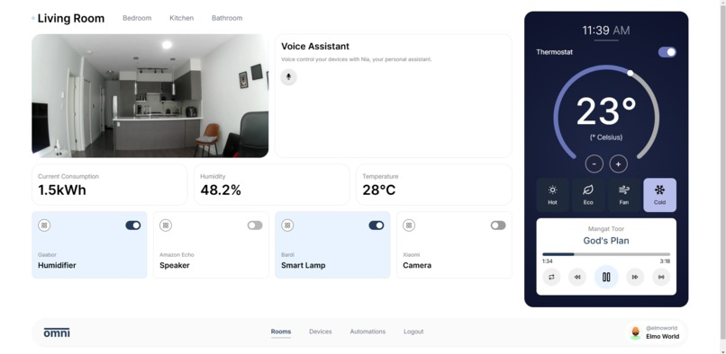

# OMNI
--------------------------------
#### Its time smart homes got smart, with omni, accessible AI meets the smart home

### Inspiration
Smart homes today are fragmented, with various standards, proprietary AI solutions, and cloud-dependent systems that compromise security and privacy. Omni was born out of a desire to simplify the smart home experience, offering seamless integration, robust local control, and cutting-edge features like gesture-based interaction and presence detection. All while prioritizing privacy, security, and reliability.

### What it does
Omni is the ultimate smart home platform, integrating every major smart home standard, including Matter, Zigbee, Z-Wave, Wi-Fi, and HomeKit. At its core is the Omni Hub, which provides:

- Local Speech-to-Text: Using an Coral Edge TPU for wake-word detection and natural language processing, Omni can process commands locally, ensuring fast and private interactions.

- Wi-Fi CSI for Presence and Gesture Recognition: Detects motion, recognizes gestures, and identifies room-level presence, enabling truly intelligent automation without relying on cameras.

- Unified Control: Omni bridges devices from multiple standards, allowing seamless operation through a single platform while supporting end-to-end encryption for secure communication.

- Whether it’s adjusting your lights with a gesture, automating routines based on presence, or controlling devices with your voice, Omni makes the smart home experience truly effortless.

### How we built it
Omni is built on a microservices architecture to ensure modularity, reliability, and ease of maintenance. Key components include:
- Omni Hub: The physical gateway that runs all core processing locally. It integrates Edge TPU acceleration for real-time speech-to-text and gesture recognition.
- Interoperability Layer: Implements drivers for Matter, Zigbee, Z-Wave, Wi-Fi, and HomeKit to unify disparate devices.
- Wi-Fi CSI Module: Utilizes CSI data for presence detection and gesture recognition through advanced machine learning models.
- Security Framework: End-to-end encryption for device communication and secure firmware updates ensure a robust security posture.
- Our tech stack features , python, node, react, redux, tailwind, coral, esp-idf, and a tiny touch of rust

Our team divided responsibilities across hardware integration, AI/ML development, and API implementation to bring Omni to life.

### Challenges we ran into
- Standard Interoperability: Harmonizing multiple smart home protocols required meticulous engineering and testing to ensure devices worked seamlessly together.
- Edge TPU Optimization: Adapting speech-to-text models for real-time inference on the Edge TPU while maintaining accuracy was a complex process.
- Wi-Fi CSI Calibration: Fine-tuning motion and gesture detection models to work in diverse home environments presented significant challenges.

### Accomplishments that we're proud of
- Achieved seamless integration across multiple major smart home standards in a single platform.
- Successfully implemented local speech-to-text processing with an Edge TPU, and local generative AI. 
- Developed an innovative use of Wi-Fi CSI for gesture and presence detection, reducing reliance on intrusive sensors like cameras.
- Delivered a secure, privacy-focused platform with robust local control.

### What we learned
-The importance of designing for scalability and maintainability through microservices, even for edge-based systems.
-How local processing not only improves privacy but also dramatically enhances responsiveness and reliability in smart home applications.
-The power and potential of emerging technologies like Wi-Fi CSI in redefining smart home interactions.

### What's next for OMNI
- Expanded CSI Functionality: Develop more advanced applications, including fall detection and behavioral analysis, for safety and wellness monitoring.
- Third-Party Developer Ecosystem: Launch an SDK for developers to create custom integrations and automations.
- AI-Enhanced Automation: Incorporate local machine learning models for predictive automation based on user habits.
- Scalability to Other Markets: Explore Omni’s applications in IoT offices, eldercare, and accessibility-focused environments.
